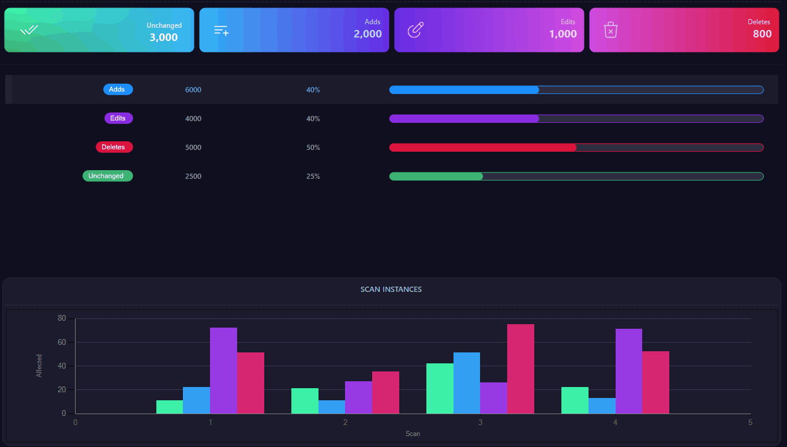
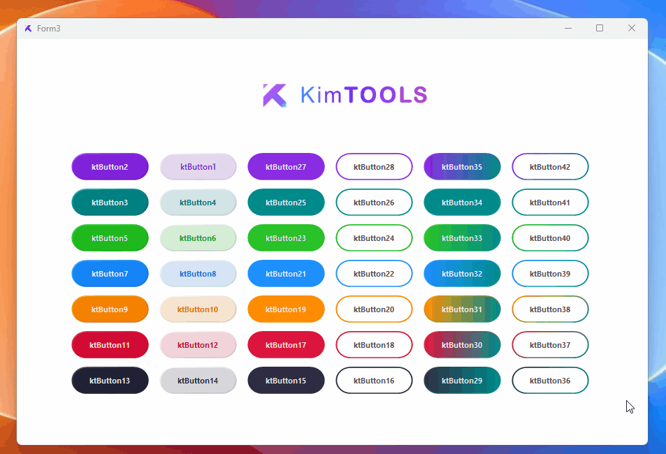
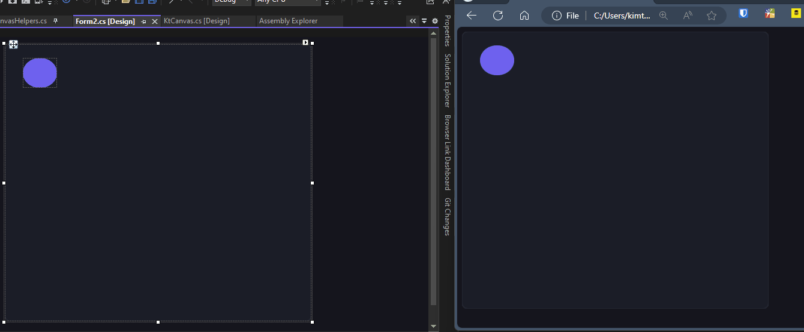
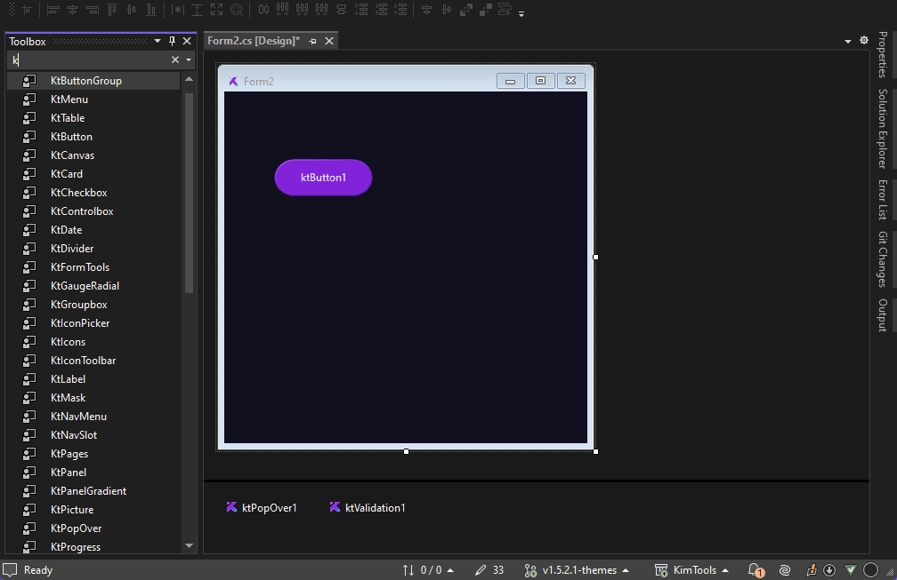
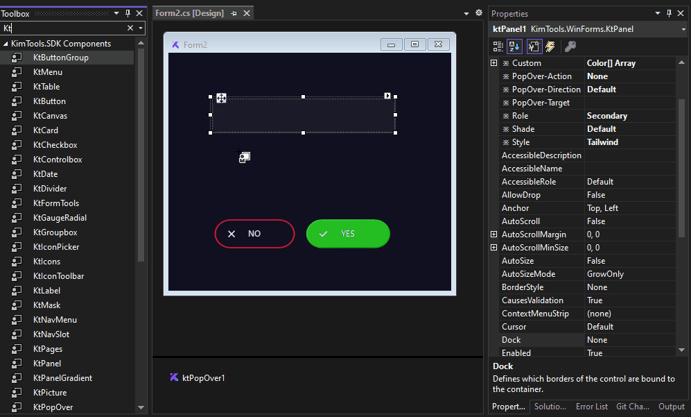

# 🔹 Welcome

<figure><figcaption></figcaption></figure>

## Welcome to <mark style="color:purple;">KimTools</mark> <mark style="color:blue;">DevKit (SDK)</mark>

### Unlock the Full Potential of Your Development

<mark style="color:purple;">**KimTools**</mark>** **<mark style="color:blue;">**DevKit**</mark> is your gateway to creating modern, visually stunning, and highly functional applications with unparalleled ease. Designed with developers in mind, this comprehensive toolkit offers an array of powerful features to enhance your workflow and elevate your projects.

* <mark style="color:blue;">**Enhanced UI Components**</mark><mark style="color:blue;">:</mark> Leverage versatile UI components tailored for WinForms, enabling you to build responsive and visually appealing interfaces with minimal effort.
* <mark style="color:blue;">**10,000+ Inbuilt Vector Icons**</mark><mark style="color:blue;">:</mark> Explore a vast library of over 10,000 vector icons, complete with an intuitive Icon Picker. Tailwind-inspired theming and drag-and-drop functionality make it easy to customize and integrate icons into your designs.
* <mark style="color:blue;">**Seamless Theming Options**</mark><mark style="color:blue;">:</mark> Effortlessly apply and customize themes, including dark mode, to create a cohesive and modern user experience across your application.
* <mark style="color:blue;">**No-Code Validation Wizard**</mark><mark style="color:blue;">:</mark> Simplify the implementation of complex validation rules with our no-code wizard. Choose from a wide range of options to ensure your forms and data inputs are accurate and user-friendly.

Start your development journey with <mark style="color:purple;">**KimTools**</mark>** **<mark style="color:blue;">**DevKit**</mark> today and transform your WinForms applications with unmatched efficiency and user satisfaction.

<figure><figcaption></figcaption></figure>

**E**quip <mark style="color:purple;">**.NET**</mark> and <mark style="color:blue;">**Visual Studio IDE**</mark> with a full collection of data centered tools to help you create beautiful, modern and future-proof applications quickly and intuitively. Whether you're a seasoned developer or new to WinForms development, this documentation provides step-by-step instructions, examples, and best practices to maximize the potential of KimTools SDK in your projects.&#x20;

<figure><figcaption></figcaption></figure>

 

<figure><figcaption></figcaption></figure>

### Don't Re-invent The Wheel Every Time  &#x20;

With fully visual <mark style="color:purple;">**components and**</mark> no-code <mark style="color:blue;">**designer wizards**</mark> with extensive customization options to minimize coding time and improve accuracy and performance.

<figure><figcaption></figcaption></figure>

Explore the possibilities and elevate your WinForms applications with KimTools SDK. Get started today and experience the difference in development efficiency and user experience.


[download.md](get-started/download.md)


## 🆕 Introducing KimTools CLT (Cross-Language Translation)

Imagine designing and exporting your existing KimTools Forms, Components, Pages, and Widgets with a few clicks, converting them From KimTools Vs Designer to other languages or frameworks.&#x20;

Whether you’re working with <mark style="color:green;">**WinForms**</mark>, <mark style="color:blue;">**NEXT.js**</mark>**,** <mark style="color:purple;">**MAUI**</mark>, <mark style="color:blue;">**ASP.NET**</mark>, <mark style="color:purple;">**Blazor**</mark>, <mark style="color:orange;">**Laravel-Livewire**</mark> or <mark style="color:yellow;">**Python**</mark>, KimTools will sync your components in real-time providing live-preview and hot-reload. KimTools CLT ensures that your designs retain their precision and responsiveness across different environments.

<figure><figcaption></figcaption></figure>

By leveraging vector-based controls, KimTools CLT delivers unparalleled flexibility and scalability, enabling your applications to look vector sharp and perform seamlessly on any platform. Embrace the future of development with the power of KimTools CLT and experience the ultimate in "Build Once, Deploy Everywhere" efficiency.

**KimTools CLT** is the perfect solution for developers who are familiar with Visual Studio and want to quickly build UIs for multiple platforms without the need to learn new tools or frameworks. Whether you’re a fan of the drag-and-drop WYSIWYG approach or prefer the convenience of KimTools’ No-Code Tools, KimTools CLT empowers you to create consistent, high-quality interfaces across all your applications.

Embrace the power of KimTools and streamline your development process like never before.

## 🔹 Highlighted Features

***

#### &#x20;     <mark style="color:blue;">In-built 10k+ Vector Icons</mark>&#x20;

<figure><figcaption></figcaption></figure>

Unlock a vast library of over <mark style="color:green;">**10,000+**</mark> vector icons seamlessly integrated into KimTools SDK. Our intuitive icon wizard simplifies the process of selecting and incorporating icons into your applications, ensuring that your UI design shines without the hassle.

#### &#x20;    🔥 <mark style="color:blue;">KimTools No-Code Validation Wizards</mark>

<figure><figcaption></figcaption></figure>

Empower your applications with robust validation capabilities using our innovative no-code Validation Wizard. Easily define and implement <mark style="color:green;">validation rules</mark> without writing complex code, streamlining the development process while maintaining data integrity.

### <mark style="color:green;">💚  Get Early access</mark> &#x20;

***
