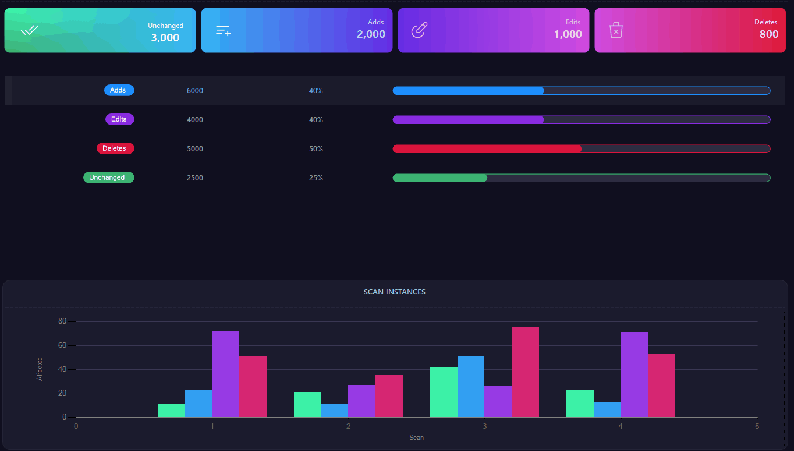
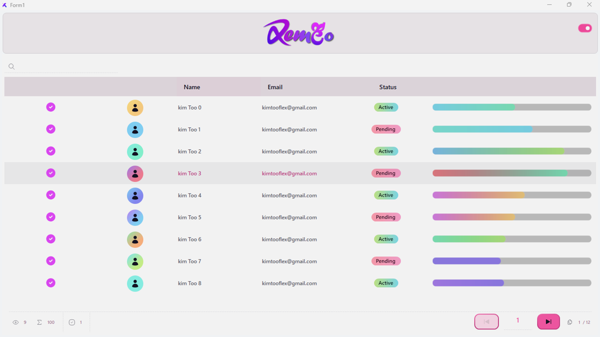
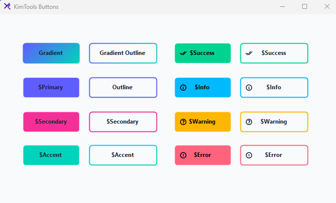

---
cover:
  light: .gitbook/assets/kimtools-shop-banner.png
  dark: .gitbook/assets/Kimtools_banner_white.png
coverY: 0
layout:
  width: default
  cover:
    visible: true
    size: full
  title:
    visible: false
  description:
    visible: false
  tableOfContents:
    visible: true
  outline:
    visible: false
  pagination:
    visible: true
  metadata:
    visible: true
---

# 🔹 Welcome

## Welcome to <mark style="color:purple;">KimTools</mark> <mark style="color:blue;">SDK</mark>

#### Modern WinForms UI Controls / Components for .NET

* .NET Framework
* .NET6
* .NET7
* .NET8
* .NET9

<mark style="color:purple;">**KimTools**</mark>**&#x20;**<mark style="color:blue;">**DevKit**</mark> is your gateway to creating modern, visually stunning, and highly functional applications with unparalleled ease. Designed with developers in mind, this comprehensive toolkit offers an array of powerful features to enhance your workflow and elevate your projects.

* <mark style="color:blue;">**Enhanced UI Components**</mark><mark style="color:blue;">:</mark> Leverage versatile UI components tailored for WinForms, enabling you to build responsive and visually appealing interfaces with minimal effort.
* <mark style="color:blue;">**10,000+ Inbuilt Vector Icons**</mark><mark style="color:blue;">:</mark> Explore a vast library of over 10,000 vector icons, complete with an intuitive Icon Picker. Tailwind-inspired theming and drag-and-drop functionality make it easy to customize and integrate icons into your designs.
* <mark style="color:blue;">**Seamless Theming Options**</mark><mark style="color:blue;">:</mark> Effortlessly apply and customize themes, including dark mode, to create a cohesive and modern user experience across your application.
* <mark style="color:blue;">**No-Code Validation Wizard**</mark><mark style="color:blue;">:</mark> Simplify the implementation of complex validation rules with our no-code wizard. Choose from a wide range of options to ensure your forms and data inputs are accurate and user-friendly.

Start your development journey with <mark style="color:purple;">**KimTools**</mark>**&#x20;**<mark style="color:blue;">**DevKit**</mark> today and transform your WinForms applications with unmatched efficiency and user satisfaction.

<figure><figcaption></figcaption></figure>

**E**quip <mark style="color:purple;">**.NET**</mark> and <mark style="color:blue;">**Visual Studio IDE**</mark> with a full collection of data centered tools to help you create beautiful, modern and future-proof applications quickly and intuitively. Whether you're a seasoned developer or new to WinForms development, this documentation provides step-by-step instructions, examples, and best practices to maximize the potential of KimTools SDK in your projects.&#x20;

<figure><figcaption></figcaption></figure> <figure><figcaption></figcaption></figure>

### Don't Re-invent The Wheel Every Time  &#x20;

With fully visual <mark style="color:purple;">**components and**</mark> no-code <mark style="color:blue;">**designer wizards**</mark> with extensive customization options to minimize coding time and improve accuracy and performance.

<figure><picture><source srcset=".gitbook/assets/kt_dark.png" media="(prefers-color-scheme: dark)"></picture><figcaption></figcaption></figure>

<figure><picture><source srcset=".gitbook/assets/KtButton.png" media="(prefers-color-scheme: dark)"></picture><figcaption></figcaption></figure>

Explore the possibilities and elevate your WinForms applications with KimTools SDK. Get started today and experience the difference in development efficiency and user experience.

***
