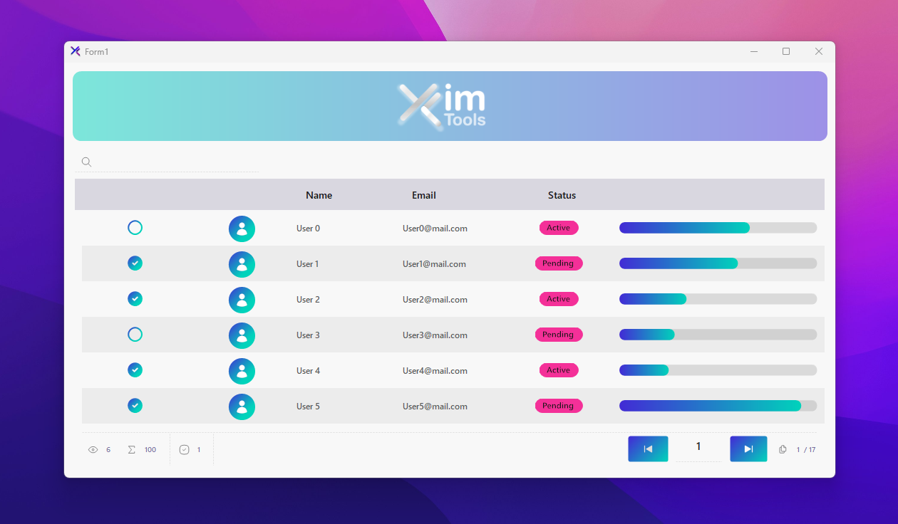

# Table

### Overview

KtTable is a modern, feature-rich data table component for WinForms that provides beautiful rendering, custom cell types, and instant search functionality. Built on top of KtColor, KtBrush, and KtIcons for consistent theming and styling.




***

#### Basic Setup

```csharp
// Add KtTable to your form (via Designer or code)
private KimTools.WinForms.KtTable ktTable1;

// Initialize in constructor
public Legacy() 
{
    InitializeComponent();
}
```

#### Designer Properties

```csharp
// Color Configuration
ktTable1.ColorBase = new KtColor("$Base_2", null, 100);
ktTable1.ColorContent = new KtColor("$Content", null, 100);
ktTable1.ColorPrimary = new KtColor("$Primary", null, 100);

// Display Options
ktTable1.ShowHeader = true;
ktTable1.ShowFooter = true;
ktTable1.ShowSearch = true;
ktTable1.ShowStriped = true;
ktTable1.MultiSelect = false;

// Navigation Buttons
ktTable1.ShowButtonFirst = false;
ktTable1.ShowButtonLast = false;

// Other Settings
ktTable1.KeyCaseSensitive = false;
ktTable1.Latency = 300;
ktTable1.Padding = new Padding(5);
```

***

### Column Configuration

<figure><picture><source srcset="../.gitbook/assets/ktTable-Dark.png" media="(prefers-color-scheme: dark)"></picture><figcaption></figcaption></figure>

#### Column Types

KtTable supports multiple column types:

* `Icon` - SVG icons
* `Avatar` - User avatars with icons
* `Text` - Standard text content
* `Badge` - Status badges with colored backgrounds
* `Progress` - Progress bars with gradient support

#### Defining Columns

```csharp
// Icon Column
var iconColumn = new KtTableColumn
{
    Key = "icon",
    Title = "",
    Type = KtTableColumnTypes.Icon,
    Width = 100,
    Visible = true,
    Search = true,
    SortMode = DataGridViewColumnSortMode.NotSortable
};

// Avatar Column
var avatarColumn = new KtTableColumn
{
    Key = "avatar",
    Title = "",
    Type = KtTableColumnTypes.Avatar,
    Width = 100,
    Visible = true
};

// Text Columns
var nameColumn = new KtTableColumn
{
    Key = "name",
    Title = "Name",
    Type = KtTableColumnTypes.Text,
    Visible = true
};

var emailColumn = new KtTableColumn
{
    Key = "email",
    Title = "Email",
    Type = KtTableColumnTypes.Text,
    IsPrimaryKey = true,  // Mark as primary key
    Visible = true
};

// Badge Column
var statusColumn = new KtTableColumn
{
    Key = "status",
    Title = "Status",
    Type = KtTableColumnTypes.Badge,
    Visible = true
};

// Progress Column
var progressColumn = new KtTableColumn
{
    Key = "progress",
    Title = "",
    Type = KtTableColumnTypes.Progress,
    Width = 200,
    Fill = "red",  // Default fill color
    Visible = true
};
```

***

### Creating Rows

#### Basic Row Creation

```csharp
// Create a new row
var record = ktTable1.CreateRow();

// Set cell values using column keys
record["name"] = "User 1";
record["email"] = "user1@mail.com";
```

#### Populating Multiple Rows

```csharp
private async void timer1_Tick(object sender, EventArgs e)
{
    timer1.Stop();

    var records = 100;
    
    for (int i = 0; i < records; i++)
    {
        var record = ktTable1.CreateRow();
        var isOdd = i % 2 == 0;
        var isChecked = i % 3 > 0;

        // Add data to each column
        record["icon"] = KtTable.Icon(/*...*/);
        record["avatar"] = KtTable.Avatar(/*...*/);
        record["name"] = $"User {i}";
        record["email"] = $"User{i}@mail.com";
        record["status"] = KtTable.Badge(/*...*/);
        record["progress"] = KtTable.Progress(/*...*/);
    }

    // Render all rows at once
    ktTable1.Render();
}
```

***

### Cell Types

#### 1. Icon Cell

Display SVG icons with color support.

```csharp
record["icon"] = KtTable.Icon(
    name: "tabler.check.circle.filled",  // Icon name
    color: (KtColor.PRIMARY, KtColor.ACCENT)  // Color tuple (primary, secondary)
);

// Alternative icons
record["icon"] = KtTable.Icon(
    name: "tabler.circle.outline",
    color: (KtColor.PRIMARY, KtColor.ACCENT)
);
```

**Parameters:**

* `name` - Icon identifier from Tabler icon set
* `color` - Tuple of two KtColor values for gradient or state colors

***

#### 2. Avatar Cell

Display user avatars with icon backgrounds.

```csharp
record["avatar"] = KtTable.Avatar(
    icon: "user",                           // Icon name
    foreground: KtColor.White,              // Icon color
    background: (KtColor.PRIMARY, KtColor.ACCENT)  // Background gradient
);
```

**Parameters:**

* `icon` - Icon name to display in avatar
* `foreground` - Color of the icon
* `background` - Tuple of KtColor values for gradient background

***

#### 3. Badge Cell

Display status badges with colored backgrounds.

```csharp
record["status"] = KtTable.Badge(
    value: "Active",              // Badge text
    foreground: !KtColor.NEUTRAL, // Text color (inverted)
    background: KtColor.NEUTRAL   // Background color
);

// Alternative
record["status"] = KtTable.Badge(
    value: "Pending",
    foreground: !KtColor.NEUTRAL,
    background: KtColor.NEUTRAL
);
```

**Parameters:**

* `value` - Text to display in badge
* `foreground` - Text color (use `!` operator to invert)
* `background` - Background color

***

#### 4. Progress Cell

Display progress bars with gradient support.

```csharp
record["progress"] = KtTable.Progress(
    value: 75,                                              // Current value
    color: new KtBrushGradient(KtColor.PRIMARY, KtColor.ACCENT),  // Gradient
    max: 100                                                // Maximum value
);

// Using random values
record["progress"] = KtTable.Progress(
    value: rand.Next(0, records + 1),
    color: new KtBrushGradient(KtColor.PRIMARY, KtColor.ACCENT),
    max: records
);
```

**Parameters:**

* `value` - Current progress value
* `color` - KtBrushGradient for the progress bar
* `max` - Maximum value (default: 100)

***

#### 5. Text Cell

Display standard text content.

```csharp
record["name"] = "John Doe";
record["email"] = "john.doe@example.com";
```

**Usage:**

* Simply assign string values directly to text columns
* No special formatting required

***

### Properties

#### Color Properties

```csharp
// Theme colors
ktTable1.ColorBase = new KtColor("$Base_2", null, 100);
ktTable1.ColorContent = new KtColor("$Content", null, 100);
ktTable1.ColorPrimary = new KtColor("$Primary", null, 100);
```

#### Display Properties

```csharp
ktTable1.ShowHeader = true;      // Show column headers
ktTable1.ShowFooter = true;      // Show footer with pagination
ktTable1.ShowSearch = true;      // Show search box
ktTable1.ShowStriped = true;     // Alternate row colors
ktTable1.MultiSelect = false;    // Allow multiple row selection
```

#### Navigation Properties

```csharp
ktTable1.ShowButtonFirst = false;  // Show "First Page" button
ktTable1.ShowButtonLast = false;   // Show "Last Page" button
```

#### Behavior Properties

```csharp
ktTable1.KeyCaseSensitive = false;  // Case-sensitive keys
ktTable1.Latency = 300;             // Search debounce in milliseconds
```

#### Layout Properties

```csharp
ktTable1.Padding = new Padding(5);  // Internal padding
ktTable1.Dock = DockStyle.Fill;     // Dock style
```

***

### Rendering

#### Render Method

Call `Render()` after adding or modifying rows to update the display.

```csharp
// Add multiple rows
for (int i = 0; i < 100; i++)
{
    var record = ktTable1.CreateRow();
    record["name"] = $"User {i}";
    record["email"] = $"user{i}@mail.com";
}

// Render all changes
ktTable1.Render();
```

**Best Practice:**

* Add all rows first, then call `Render()` once
* Avoid calling `Render()` inside loops for better performance

***

### Complete Example

```csharp
using System;
using System.Drawing;
using KimTools.WinForms;

namespace Sarah.Forms
{
    public partial class Legacy : KtWindow
    {
        private Random rand = new Random();

        public Legacy() 
        {
            InitializeComponent();
        }

        private async void timer1_Tick(object sender, EventArgs e)
        {
            timer1.Stop();

            var records = 100;

            for (int i = 0; i < records; i++)
            {
                var record = ktTable1.CreateRow();
                var isOdd = i % 2 == 0;
                var isChecked = i % 3 > 0;

                // Icon column with check/uncheck states
                record["icon"] = KtTable.Icon(
                    name: isChecked ? "tabler.check.circle.filled" : "tabler.circle.outline",
                    color: (KtColor.PRIMARY, KtColor.ACCENT)
                );

                // Avatar column with user icon
                record["avatar"] = KtTable.Avatar(
                    icon: "user",
                    foreground: KtColor.White,
                    background: (KtColor.PRIMARY, KtColor.ACCENT)
                );

                // Text columns
                record["name"] = $"User {i}";
                record["email"] = $"User{i}@mail.com";

                // Badge column with status
                record["status"] = KtTable.Badge(
                    value: isOdd ? "Active" : "Pending",
                    foreground: !KtColor.NEUTRAL,
                    background: KtColor.NEUTRAL
                );

                // Progress column with random values
                record["progress"] = KtTable.Progress(
                    value: rand.Next(0, records + 1),
                    color: new KtBrushGradient(KtColor.PRIMARY, KtColor.ACCENT),
                    max: records
                );
            }

            // Render the table
            ktTable1.Render();
        }
    }
}
```

***

### Tips & Best Practices

#### Performance

* **Batch Operations**: Add all rows before calling `Render()`
* **Search Latency**: Adjust `Latency` property for search responsiveness
* **Column Width**: Set explicit widths for performance with large datasets

#### Styling

* **Color Consistency**: Use theme colors (PRIMARY, ACCENT, NEUTRAL) for consistency
* **Gradients**: Use `KtBrushGradient` for modern, vibrant progress bars
* **Icons**: Use Tabler icon naming convention: `tabler.icon.name`

#### Data Management

* **Primary Keys**: Mark one column as `IsPrimaryKey` for row identification
* **Search**: All columns have `Search = true` by default for instant filtering
* **Sorting**: Configure `SortMode` per column as needed

***

### JSON Integration

KtTable includes built-in JSON parsing for API integration:

```csharp
// Example: Load data from API
var jsonData = await FetchFromAPI("https://api.example.com/users");
var users = ParseJson(jsonData);

foreach (var user in users)
{
    var record = ktTable1.CreateRow();
    record["name"] = user.Name;
    record["email"] = user.Email;
    record["status"] = KtTable.Badge(
        value: user.Status,
        foreground: !KtColor.NEUTRAL,
        background: KtColor.NEUTRAL
    );
}

ktTable1.Render();
```

***

### Advanced Features

#### Custom Colors

```csharp
// Using custom color variables
var color = isOdd ? KtColor.PRIMARY : KtColor.ACCENT;
var gradient = isOdd ? KtColor.ACCENT : KtColor.PRIMARY;

record["icon"] = KtTable.Icon(
    name: "tabler.star",
    color: (color, gradient)
);
```

#### Dynamic Theming

```csharp
// Theme changes are reflected automatically
KTheme.Current.Render();
```

#### Color Inversion

```csharp
// Use ! operator to invert colors
foreground: !KtColor.NEUTRAL  // Inverts the neutral color
```

***

### Summary

KtTable provides a complete modern table solution with:

* ✅ **Custom scrollbars** - No ugly default scrollbars
* ✅ **Rich cell types** - Icons, Avatars, Badges, Progress bars
* ✅ **Instant search** - Real-time filtering with debounce
* ✅ **KtColor integration** - Consistent theming and gradients
* ✅ **SVG icons** - Crisp Tabler icons at any size
* ✅ **JSON support** - Built-in parsing for API integration
* ✅ **High performance** - Optimized rendering for large datasets

For more information about [KtColor](../utilities/kt-color.md), [KtBrush](../utilities/kt-brush.md), and [KtIcons](../components/kt-icons.md), refer to their respective documentation.
