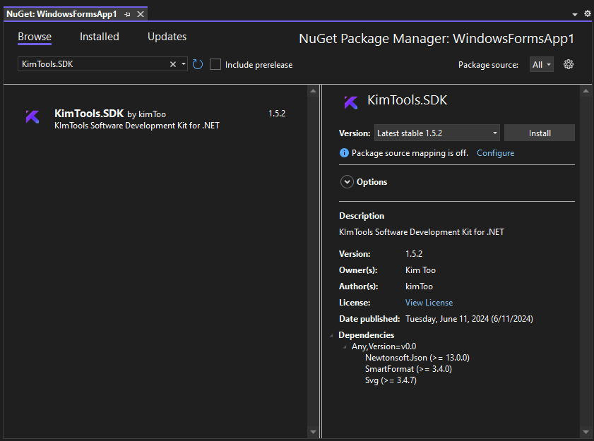

# 🔹 Install & Upgrade

<figure><figcaption></figcaption></figure>

#### Installation and Upgrade Guide

1. **Purchase KimTools SDK**
   * If you don't already have a license, purchase KimTools SDK.
2. **Download KimTools SDK**
   * Check your purchase confirmation email for the download link (also check your Spam folder). Download the `KimTools.SDK.****.zip` file.
3. **Create or Open a Project**
   * If you are integrating KimTools into an existing project, proceed to step 4. Otherwise, create a new WinForms project targeting .NET Framework 4.8 or higher.
4. **Extract Files**
   * Extract all files from the downloaded `KimTools.SDK.****.zip` into your project solution folder (`.sln`).
   * **Upgrading?** Extract all files from the downloaded `KimTools.SDK.****.zip and` replace any existing files.
5. **Manage NuGet Packages**
   * Right-click on your project and select "Manage NuGet Packages."
6. **Configure Package Source**
   * Ensure "All" is selected as the package source to include KimTools.
7. **Install KimTools SDK**
   * Search for `KimTools.SDK` and click "Install."
