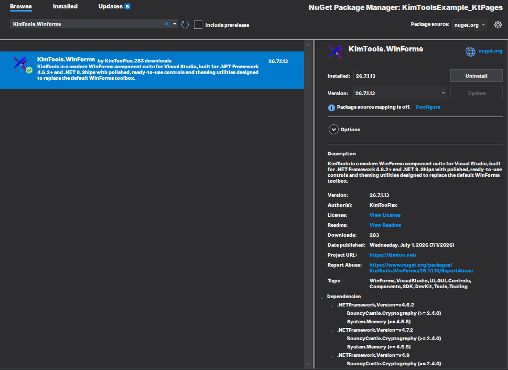

# Install & Upgrade

## Install & Update

KimTools is distributed on NuGet as [`KimTools.WinForms`](https://www.nuget.org/packages/KimTools.WinForms). This covers both the Free and Plus+ tiers - the package is the same either way, and your license unlocks the controls you're entitled to.

<figure><figcaption></figcaption></figure>

### Requirements

* **.NET Framework 4.6.2+** (4.7.2 and 4.8 also supported) or **.NET 8.0 (Windows)**
* Visual Studio, with a WinForms project targeting one of the frameworks above
* Internet connection on first launch, so KimTools can verify your license

### Install

#### Package Manager Console

```
NuGet\Install-Package KimTools.WinForms
```

#### .NET CLI

```
dotnet add package KimTools.WinForms
```

#### PackageReference

```xml
<PackageReference Include="KimTools.WinForms" Version="26.7.1" />
```

After installing, rebuild your project. KimTools controls will appear in the Visual Studio Toolbox under the **KimTools** category — no manual toolbox setup needed.

If the Toolbox doesn't refresh right away, close and reopen the form/UserControl designer, or restart Visual Studio.

### Licensing

Free and Plus+ members get a license key tied to their KimToo.net account, verified automatically when signed in through the app.

* 🔵 Utilities (`Kt-Color`, `Kt-Brush`, `Kt-Icons`) — free to all, no license required
* 🟢 Free license — unlocks all 14 Free controls
* 🟣 Plus+ license — unlocks all Free controls plus 25 exclusive Plus+ controls

No manual key entry is required. Just make sure you're online the first time you open a project with KimTools controls so it can confirm your membership.

### Update

#### Package Manager Console

```
Update-Package KimTools.WinForms
```

#### .NET CLI

```
dotnet add package KimTools.WinForms
```

Running `dotnet add package` again pulls the latest version and updates your project file.

#### PackageReference

Bump the version number manually:

Replace \*.\*.\* with the latest Kimtools version on nuget

```xml
<PackageReference Include="KimTools.WinForms" Version="*.*.*" />
```

Then restore packages (Visual Studio does this automatically on build, or run `dotnet restore`).

> **Tip:** Check the [Versions tab on NuGet](https://www.nuget.org/packages/KimTools.WinForms#versions-body-tab) for the latest release, or watch the [release notes](https://www.nuget.org/packages/KimTools.WinForms#releasenotes-body-tab).

### Uninstall

#### Package Manager Console

```
Uninstall-Package KimTools.WinForms
```

#### .NET CLI

```
dotnet remove package KimTools.WinForms
```

### Troubleshooting

**Controls missing from the Toolbox after install** Rebuild the project, then close and reopen the designer. If that doesn't work, restart Visual Studio.

**License not verifying** Confirm you're signed in through the app and have an active internet connection. Verification happens automatically — there's no key to enter.

**Targeting an unsupported framework** KimTools requires .NET Framework 4.6.2+ or .NET 8.0 (Windows). Older targets (.NET Framework 4.5.x and below, or non-Windows .NET) aren't supported.

### Need Help?

* 🌐 [KimToo.net](https://kimtoo.net/)
* 🎫 [Support](https://support.kimtoo.net/) — submit a ticket, request a feature, or report a bug
